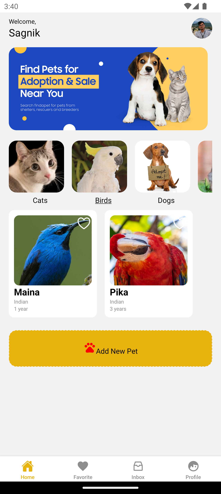

<!-- PROJECT LOGO -->
 

  

<h3 align="center">Pet Adoption App</h3>

  

    An interactive mobile app to facilitate pet adoption, built with React Native, using Expo and TypeScript. This app integrates Firebase for backend operations and Cloudinary for image uploads.
     
    <a href="https://github.com/saha-sagnik/Pet-Adoption"><strong>Explore the docs »</strong></a>
     
     
    <a href="https://github.com/saha-sagnik/Pet-Adoption">View Demo</a>
    ·
    <a href="https://github.com/saha-sagnik/Pet-Adoption/issues/new?labels=bug&template=bug-report---.md">Report Bug</a>
    ·
    <a href="https://github.com/saha-sagnik/Pet-Adoption/issues/new?labels=enhancement&template=feature-request---.md">Request Feature</a>
  

<!-- TABLE OF CONTENTS -->

  
Table of Contents

  <ol>
    <li>
      <a href="#about-the-project">About The Project</a>
      <ul>
        <li><a href="#built-with">Built With</a></li>
      </ul>
    </li>
    <li>
      <a href="#getting-started">Getting Started</a>
      <ul>
        <li><a href="#prerequisites">Prerequisites</a></li>
        <li><a href="#installation">Installation</a></li>
      </ul>
    </li>
    <li><a href="#usage">Usage</a></li>
    <li><a href="#roadmap">Roadmap</a></li>
    <li><a href="#contributing">Contributing</a></li>
    <li><a href="#license">License</a></li>
    <li><a href="#contact">Contact</a></li>
    <li><a href="#acknowledgments">Acknowledgments</a></li>
  </ol>

<!-- ABOUT THE PROJECT -->
## About The Project

[![Pet Adoption App Screen Shot][product-screenshot]](https://example.com)

The Pet Adoption App is designed to streamline the process of adopting pets, providing functionalities such as viewing pet profiles, favoriting pets, and initiating adoption processes. Users can also add new pets for adoption and communicate through an integrated chat feature.

### Screenshots

- **Login Screen**

  

- **Home Screen**

  
  

- **Pet Profile**
  

- **Add Pet**
  

- **Favorites**
  

- **Chat Feature**
  

- **User Profile Screen**
  

### Built With

This section should list any major frameworks/libraries used to bootstrap your project. Leave any add-ons/plugins for the acknowledgements section. Here are a few examples.
* [React Native](https://reactnative.dev/)
* [Expo](https://expo.dev/)
* [Firebase](https://firebase.google.com/)
* [Cloudinary](https://cloudinary.com/)

